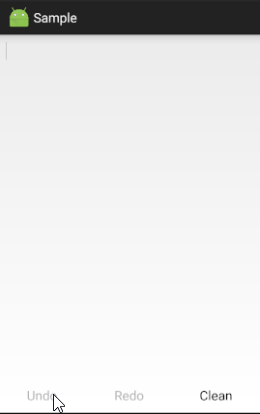

# TextUndoRedo
  This is an android text `undo redo` library. The library is very `small`, only `a Java file`.

# ScreenShot


# Usage
1. Will [TextUndoRedo.java](library/src/main/java/arowa_z/textundoredo/library/TextUndoRedo.java) copy to your project.

2. To bind TextUndoRedo and EditText.
  ```java
  TUR = new TextUndoRedo(EditText editText, TextChangeInfo info);
  ```
3. call exeUndo() or exeRedo().
  ```java
  TUR.exeUndo();  

  TUR.exeRedo();
  ```

# Note
Call `exeUndo()` before please make sure that `canUndo()` is `true`, `exeRedo()` too.  
  ```java
  if(canUndo){
    exeUndo();
  }
  
  if(canRedo){
    exeRedo();
  }
  ```
  This is the safest.

or, You can use the interface `TextChangeInfo` to in time call `canUndo()` and `canRedo()`.  
  ```java
  public interface TextChangeInfo {
    void textAction();
  }
  ```
  ```java
  public void textAction() {
    btn_undo.setEnabled(TUR.canUndo());
    btn_redo.setEnabled(TUR.canRedo());
  }
  ```
but, You need to deal with the issue of the screen direction.(Every time a `new TextUndoRedo` will create a new `Record`)
  ```xml
  android:configChanges="orientation|keyboardHidden|screenSize"
  ```
  or
  ```xml
  android:screenOrientation="portrait"
  ```
  or
  ```xml
  android:screenOrientation="landscape"
  ```
  or
  ```xml
  ......
  ```
For the above these problems, you can consult [sample](sample/src/main) :)

# Author
Name: [Arowa_Z](https://github.com/Arowa-Z)  
Email: Arowa_Z@qq.com
